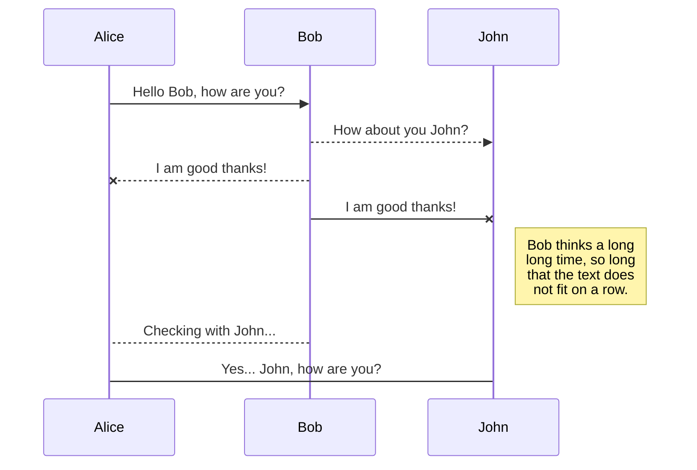
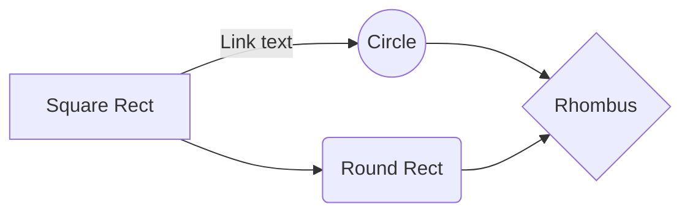

# Error Handling for REST with Spring

# Overview
Spring 3.2 trở về **trước**, có 2 cách chính để handle exception trong Spring MVC là:
* *HandlerExceptionResolver*
* *@ExceptionHandler* annotation.

Bắt đầu từ **3.2**, Spring sử dụng *@ControllerAdvice* annotation để giải quyết 2 giới hạn của những 2 solution trên.

# Solution 1 - *@ExceptionHandler*
The first solution work at the **Controller level** .

For example:

    public class FooController {
	    @ExceptionHandler({CustomExc1.class, CustomExc2.class})
	    public void handleException() {
		    .........
	    }
    }

We'll define a method to handle exceptions and annotate that with *@ExceptionHandler* which is only action for that particular Controller.

=> This approach is the major drawback.

# Solution 2 - The HandlerExceptionResolver
This solution will resolve any exception thrown by the app and allow us to implement a **uniform exception handling mechanism** in REST API

## ExceptionHandlerExceptionResolver
This is enabled by default in the DispatcherServlet. This is actually the core component of how the *@ExceptionHandler* mechanism presented earlier works. 
## DefaultHandlerExceptionResolver
Enabled by default in the DispatcherServlet.

This resolve standard Spring exception to their corresponding HTTP Status code (Client error - 4xx and Server error - 5xx).

This **only set the HTTP Status Code** of the Response properly, but it **doesn't set anything to body** of response.

## ResponseStatusExceptionResolver
Enabled by default in the DispatcherSerlvet. 
Its main responsibility is to use the *@ResponseStatus* annotation **available on custom exceptions** and to map these exceptions to HTTP Status Code .

For example:

    @ResponseStatus(value = HttpStatus.NOT_FOUND)
    public class CustomExc extends RuntimeException {
	    public CustomExc() {
		    super();
	    }
	    public CustomExc(String msg) {
		    super(msg);
	    }
	    public CustomExc(String msg, Throwable cause) {
		    super(msg, cause);
	    }
	    .....blabla
    }

But, It like the above exceptions, which is limited in the way it deals with the body of response.
* Deal with: solve a problem or make a decision, or give your attention to s.one/s.thing.

## SimpleMappingExceptionResolver and AnnotationMethodHandlerExceptionResolver

## HandlerExceptionResolver

# New Solution 3 - @ControllerAdvice annotation

**Spring 3.2** brings support for a  global *@ExceptionHandler* with the new *@ControllerAdvice* annotation. This enable the mechanism that **makes use of *ResponseEntity*** along with type safety and flexibility of *@ExceptionHandler*.

> Multiple *@ExceptionHandler* to **single, global* error handling component.

    @ControllerAdvice
    public class RestExceptionHandler extends ResponseEntityExceptionHandler {
	    @ExceptionHandler({
		    IllegalArgumentException.class,
		    IllegalStateException.class})
	    protected ResponseEntity<Object> handleConflict (RuntimeException exc, WebRequest req) {
		    String bodyOfResponse = "....bla..bla";
		    return handleExceptionInternal(
							    ex, 
								bodyOfResponse, 
								new HttpRequest(),
								HttpStatus.Conflict, 
								req);
	    }
    }

Not only simple but also flexible:

 - Allow full control the body of response .
 - Allow mapping of several exceptions to the same method (to be handled together).
 - Allow makes use of ResponseEntity in REST API

## Publish a File

You can publish your file by opening the **Publish** sub-menu and by clicking **Publish to**. For some locations, you can choose between the following formats:

- Markdown: publish the Markdown text on a website that can interpret it (**GitHub** for instance),
- HTML: publish the file converted to HTML via a Handlebars template (on a blog for example).

## Update a publication

After publishing, StackEdit keeps your file linked to that publication which makes it easy for you to re-publish it. Once you have modified your file and you want to update your publication, click on the **Publish now** button in the navigation bar.

> **Note:** The **Publish now** button is disabled if your file has not been published yet.

## Manage file publication

Since one file can be published to multiple locations, you can list and manage publish locations by clicking **File publication** in the **Publish** sub-menu. This allows you to list and remove publication locations that are linked to your file.

# Markdown extensions

StackEdit extends the standard Markdown syntax by adding extra **Markdown extensions**, providing you with some nice features.

> **ProTip:** You can disable any **Markdown extension** in the **File properties** dialog.

## SmartyPants

SmartyPants converts ASCII punctuation characters into "smart" typographic punctuation HTML entities. For example:

|                |ASCII                          |HTML                         |
|----------------|-------------------------------|-----------------------------|
|Single backticks|`'Isn't this fun?'`            |'Isn't this fun?'            |
|Quotes          |`"Isn't this fun?"`            |"Isn't this fun?"            |
|Dashes          |`-- is en-dash, --- is em-dash`|-- is en-dash, --- is em-dash|

## KaTeX

You can render LaTeX mathematical expressions using [KaTeX](https://khan.github.io/KaTeX/):

The *Gamma function* satisfying $\Gamma(n) = (n-1)!\quad\forall n\in\mathbb N$ is via the Euler integral

$$
\Gamma(z) = \int_0^\infty t^{z-1}e^{-t}dt\,.
$$

> You can find more information about **LaTeX** mathematical expressions [here](http://meta.math.stackexchange.com/questions/5020/mathjax-basic-tutorial-and-quick-reference).

## UML diagrams

You can render UML diagrams using [Mermaid](https://mermaidjs.github.io/). For example, this will produce a sequence diagram:

And this will produce a flow chart:

<!--stackedit_data:
eyJoaXN0b3J5IjpbNzcwNzg3NDQ2LDEwMTY2NTMyMzAsLTcyMT
E1MDk3NCwxNDI1MDc5MzExLC0xMDgwNDQzMjg5LDI1MDgzNjY5
Niw5MjEzNzI1NTAsLTE5MzUyNDYzMzRdfQ==
-->